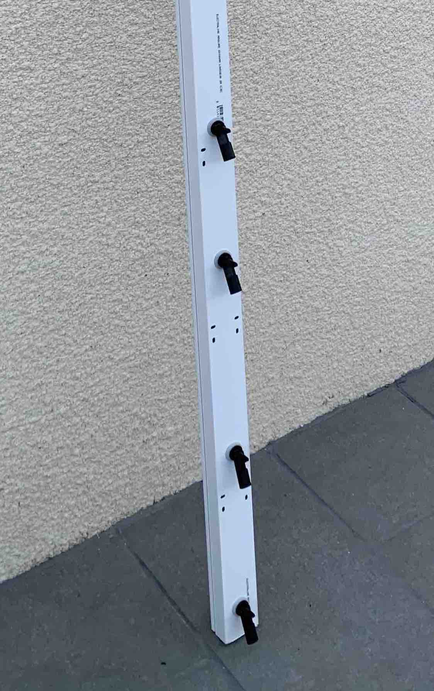
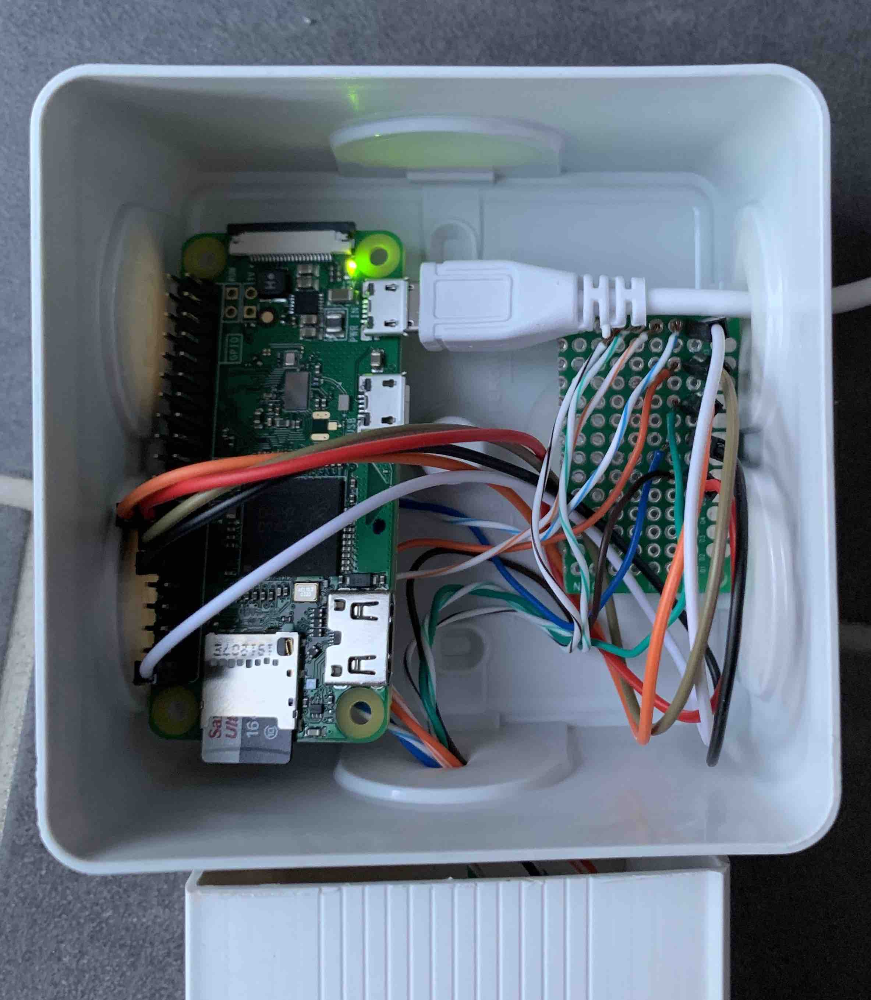

# Well Level

Well water level as an API ⛲️.

## Hardware

* Raspberry Pi Zero WH
* 4 Float Sensor Switches
* A bar to hold the sensors

## Configuration

Edit the GPIO pins in `well.js`.

## Start the service

`npm start`

## Fetch the API

You can get the water level by fetching `http://<DEVICE_IP>:3000/`.

Here's the result you'll get:

```json
{
    "levelLow": 1,
    "levelMiddle": 1,
    "levelHigh": 0,
    "levelFlood": 0
}
```

## Contribute

```
npm install
npm run dev
```

## Pictures




